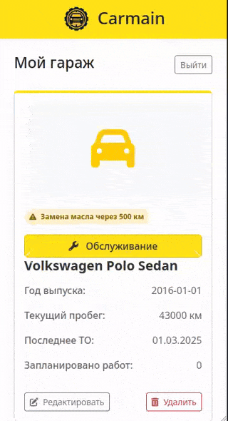

# Carmain - Система управления техническим обслуживанием автомобилей

<div align="center">
  
</div>

Carmain - веб-приложение для управления техническим обслуживанием автомобилей. Отслеживайте историю проведенных работ, получайте напоминания о запланированных процедурах и никогда не забывайте о важном обслуживании.

## Основные возможности

**Управление автомобилями**
- Регистрация неограниченного количества автомобилей
- Хранение информации: марка, модель, год выпуска, текущий пробег
- Персональный гараж для каждого пользователя

**Планирование технического обслуживания**
- Готовый каталог типовых работ (замена масла, фильтров, тормозных колодок и др.)
- Настраиваемые интервалы обслуживания для каждого автомобиля
- Отслеживание последней даты и пробега выполнения работ

**Ведение истории обслуживания**
- Полный журнал выполненных работ с возможностью редактирования
- Запись даты обслуживания, пробега и комментариев
- Удобный поиск и фильтрация записей

**Умные напоминания**
- Автоматическое определение просроченного обслуживания
- Цветовые индикаторы статуса (просрочено, скоро требуется, выполнено)
- Приоритизация наиболее срочных работ

## Технологии

- **Backend**: FastAPI, SQLAlchemy ORM, PostgreSQL
- **Frontend**: HTMX, Bootstrap 5, Alpine.js, Jinja2
- **Architecture**: Clean Architecture (Repository + Service layers)
- **Authentication**: Cookie-based sessions
- **Deploy**: Docker, Gunicorn, Nginx

## Быстрый старт

### Установка через Docker (рекомендуется)

```bash
# Клонирование репозитория
git clone https://github.com/yourusername/carmain.git
cd carmain

# Запуск среды разработки
make dev

# Или запуск продакшн-версии
make build-prod && make up-prod
```

Приложение будет доступно по адресу: `http://localhost:8000`

### Локальная установка

```bash
# Установка зависимостей
poetry install

# Настройка окружения
cp .env.example .env
# Отредактируйте .env с настройками базы данных

# Запуск приложения
poetry run uvicorn carmain.main:carmain --reload
```

## Команды разработки

```bash
make help           # Показать все доступные команды
make dev           # Запустить среду разработки
make prod          # Запустить продакшн среду
make logs          # Показать логи
make backup-db     # Создать бэкап базы данных
make clean         # Очистить контейнеры
```

## Настройка окружения

Основные переменные в `.env`:

```env
SECRET_KEY=your-secret-key
DB_NAME=carmain_db
POSTGRES_USER=carmain_user
POSTGRES_PASSWORD=secure_password
ADMIN_EMAIL=admin@example.com
```

## Лицензия

Распространяется под лицензией MIT. Подробности в файле [LICENSE](LICENSE).